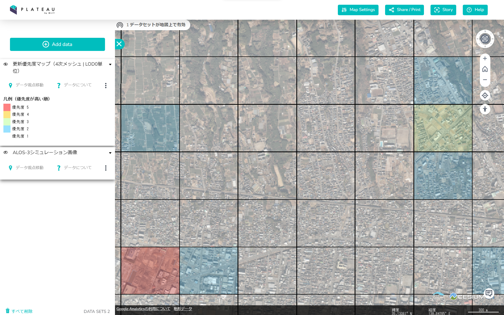
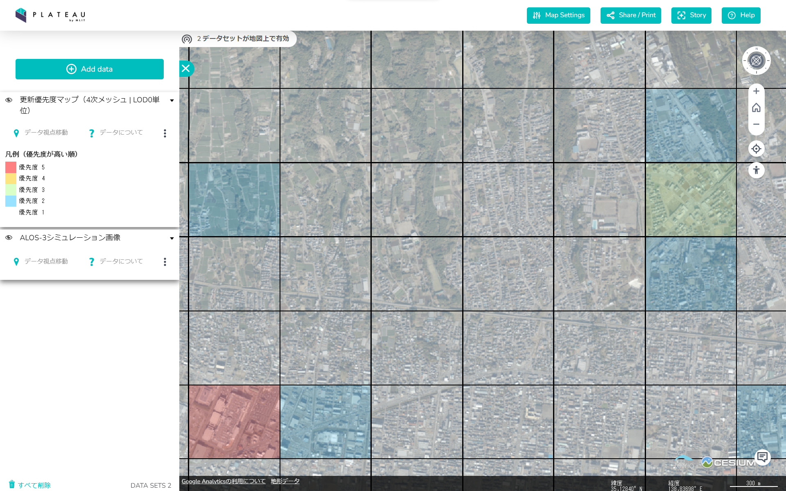

# 令和4年度 民間ユースケース開発　UC22-007「3D都市モデルの更新優先度マップ」
Project PLATEAUにて公開されている航空写真とALOS-3衛星（シミュレーション）画像の間において、建築物の変化箇所を検出し更新優先度のメッシュを生成します。

 

# [旧時期（2017年撮影 航空写真）](#tab/old)

# [新時期（2019年撮影 ALOS-3衛星シミュレーション画像）](#tab/new)

---

## ユースケースの概要
インフラ維持管理や災害復旧等の多様な領域で課題解決に貢献する3D都市モデルの活用を更に進めるためには、3D都市モデルの更新頻度を高め、現実の都市空間との同一性を保つことが重要となります。  
本ユースケースでは、3D都市モデルの整備に利用した航空写真と撮影頻度が高い衛星画像を比較し、建物等の新築・滅失等の変化を抽出するAIモデルを開発しました。  
これにより、3D都市モデルと現実空間の差分を低コストで迅速に可視化し、3D都市モデルのデータの更新を促していくことを目標としています。

## 開発システムの概要
Project PLATEAUにて公開されている航空写真とALOS-3衛星（シミュレーション）画像の間において、AIを用いて建築物の変化箇所を検出し、地域メッシュ（3～5次）単位で更新優先度の情報を持ったメッシュを生成します。 

GitHubリポジトリにて、以下の処理を行うスクリプトをOSSとして公開しています。  

- 変化検出に使用する画像のダウンロード  
- 深層学習モデルを用いた旧時期航空写真と新時期ALOS-3衛星（シミュレーション）画像からの建築物の変化確率画像生成  
- 生成した建築物の変化確率画像を用いた更新優先度マップの生成およびスタイリング  

## ライセンス
* 本マニュアルの著作権は国土交通省に帰属します。
* 本マニュアルは[Project PLATEAUのサイトポリシー](https://www.mlit.go.jp/plateau/sitepolicy/)（CC BY 4.0および政府標準利用規約2.0）に従い提供されています。

## 注意事項
* 本マニュアルは参考資料として提供しているものです。動作保証は行っておりません。
* 予告なく変更・削除する可能性があります。
* 本マニュアルの利用により生じた損失及び損害等について、国土交通省はいかなる責任も負わないものとします。

## 参考資料
*  [3D都市モデルの更新優先度マップ 技術検証レポート](https://www.mlit.go.jp/plateau/libraries/technical-reports/)
*  [PLATEAU Webサイト Use caseページ「3D都市モデルの更新優先度マップ」](https://www.mlit.go.jp/plateau/use-case/uc22-007/)
*  [GitHubリポジトリ](https://github.com/pascoais/PLATEAU-UC22-007-Update-Priority-Map)
