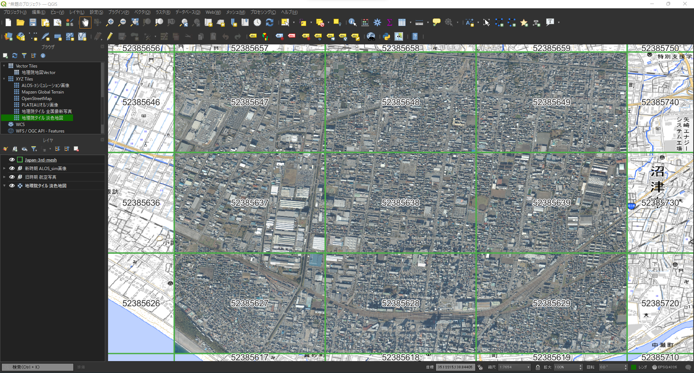

# 画像のダウンロード

## 概要
本ページでは、更新優先度マップを作成するために必要なデータである旧時期の航空写真および新時期のALOS-3衛星（シミュレーション）画像のダウンロードを行います。  


## STEP1: 旧時期航空写真のダウンロード
Project PLATEUにて公開されている[PLATEAUオルソ](https://github.com/Project-PLATEAU/plateau-streaming-tutorial/blob/main/ortho/plateau-ortho-streaming.md)から[更新優先度マップ作成の条件設定](setting.md)で設定した範囲を建築物の変化検出の旧時期に使用する画像としてダウンロードします。  
旧時期航空写真をダウンロードするには、以下のコマンドを実行してください。
```bash
python download_tile_image.py old
```

## STEP2: 新時期ALOS-3衛星（シミュレーション）画像のダウンロード
本ユースケース開発にて公開しているALOS-3衛星（シミュレーション）画像から[更新優先度マップ作成の条件設定](setting.md)で設定した範囲を建築物の変化検出の新時期に使用する画像としてダウンロードします。  
新時期ALOS-3衛星（シミュレーション）画像をダウンロードするには、以下のコマンドを実行してください。
```bash
python download_tile_image.py new
```

## STEP3: ダウンロードした画像の確認
[更新優先度マップ作成の条件設定](setting.md)にて設定した画像の保存先に`old`および`new`というフォルダが生成されています。  
`old`には旧時期航空写真が、`new`には新時期ALOS-3衛星（シミュレーション）画像が保存されています。  
`ls`コマンドで指定した3次メッシュコードをファイル名として、対象範囲の画像が格納されていることを確認します。
```bash
(update_priority_map) root@e5c04beb7310:/workspace/data/sample/image# ls old
52385627.png          52385628.png          52385629.png          52385637.png          52385638.png          52385639.png          52385647.png          52385648.png          52385649.png
52385627.png.aux.xml  52385628.png.aux.xml  52385629.png.aux.xml  52385637.png.aux.xml  52385638.png.aux.xml  52385639.png.aux.xml  52385647.png.aux.xml  52385648.png.aux.xml  52385649.png.aux.xml
(update_priority_map) root@e5c04beb7310:/workspace/data/sample/image# ls new
52385627.png          52385628.png          52385629.png          52385637.png          52385638.png          52385639.png          52385647.png          52385648.png          52385649.png
52385627.png.aux.xml  52385628.png.aux.xml  52385629.png.aux.xml  52385637.png.aux.xml  52385638.png.aux.xml  52385639.png.aux.xml  52385647.png.aux.xml  52385648.png.aux.xml  52385649.png.aux.xml
(update_priority_map) root@e5c04beb7310:/workspace/data/sample/image#
```


> [!TIP]
> GISが使える方は、指定した範囲の3次メッシュコードのポリゴンとともに画像を表示して、対象範囲の画像がダウンロードされているか確認することも可能です。  
> <br/>
>   