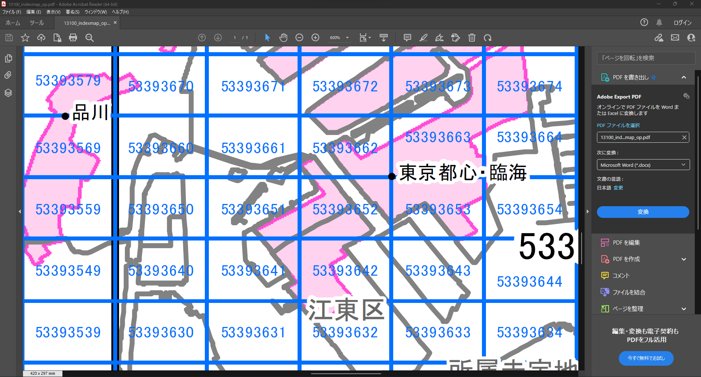

# 更新優先度マップ作成の条件設定

## 概要
本ページでは、更新優先度マップ作成にあたり、以下の条件を設定します。 
- 更新優先度マップの作成領域  
- 建築物の変化検出に使用する画像の保存場所  
- 建築物の変化検出に使用する画像のズームレベル  


## STEP1: 更新優先度マップ作成領域の設定
更新優先度マップを作成したい領域を含む3次メッシュコードを以下のサンプルにならい、テキストファイルに記載します。   
```text
52385627
52385628
52385629
52385637
52385638
52385639
52385647
52385648
52385649
```
3次メッシュコードについては、Project PLATEAUで公開しているCityGML形式の3D都市モデルに付随する図郭マップ（[例](https://www.geospatial.jp/ckan/dataset/plateau-tokyo23ku/resource/28d1efab-c1f9-4ad9-891b-4b8a4b3a99ae)）のPDFなどをご覧ください。  
なお、処理の関係上、日本全国の3次メッシュポリゴンのESRI Shapefileが`./data/Japan-3rd-mesh`に格納されています。そのため、GISが使える方はそのデータを用いて3次メッシュコードを確認することもできます。  


▲ G空間情報センターで公開されているCityGML形式の3D都市モデルに付随する図郭マップで確認した例


▲ QGISを用いて`./data/Japan-3rd-mesh`に格納されている3次メッシュポリゴンで確認した例


## STEP2: 画像ダウンロードの設定
[./conf/config.yml](https://github.com/pascoais/PLATEAU-UC22-007-PASCO/blob/main/conf/config.yml) （以下、設定ファイルと記載）に以下の項目を設定します。  
1. [STEP1](setting.md#step1-更新優先度マップ作成領域の設定)で設定した更新優先度マップ作成領域のテキストファイルのパスを`aerial_download.mesh_code`に記載してください。  
2. 設定ファイルの `aerial_download.output` に画像保存先のパスを記載してください。  

```yaml
aerial_download:
  scene: old
  url: 'https://gic-plateau.s3.ap-northeast-1.amazonaws.com/2020/ortho/tiles'
  mesh_code : &mesh_code ./data/sample/aoi/3rd_mesh_code_list.txt
  zoom_level: 19
  output: &image_path ./data/sample/image
```

> [!WARNING]
> 設定ファイル の `alos3_download.url` は検証時のままになっています。ALOS-3衛星（シミュレーション）画像の公開先URLに変更してお使いください。


> [!TIP]
> - 福島県郡山市の航空写真は、東側がズームレベル19で提供されていません。そのため、当該地域をダウンロードする場合は、**ズームレベル18でダウンロードしてください。**  
> - 大阪府大阪市の航空写真は、解像度が1mとなります。そのため、当該地域をダウンロードする場合は、ズームレベル17でダウンロードすることをお勧めいたします。  
> - ダウンロードする旧時期航空写真のズームレベルに関しては`aerial_download.zoom_level`に記載されています。


## STEP3: 処理結果出力先の設定
設定ファイルを用いて建築物の変化確率画像、更新優先度マップ、スタイリングした更新優先度マップの出力先を設定します。  

建築物の変化確率画像は`generate_probmap.output`に、更新優先度マップは`create_mesh.output`に、スタイルを反映した更新優先度マップは`style.output_dir`に出力先のパスを記載してください。  
また、作成する更新優先度マップのファイル名を`create_mesh.filename`に記載してください。　　 

**建築物の変化確率画像の出力先**  

```yaml
generate_probmap:
  image_path: *image_path
  target: *mesh_code
  patch_size: 1024
  batch_size: 1
  cd_weight: pretrained/unet.pth
  sr_weight: pretrained/rrdb.pth
  output: &probmap ./data/sample/probmap
```

**更新優先度マップの出力先**  
更新優先度マップの出力先以外に出力ファイル名も記載してください。

```yaml
create_mesh:
  probmap: *probmap
  target: *mesh_code
  bldg: &lod0 ./data/citygml-bldg-lod0/22203_numazu-shi_bldg.shp
  threshold: ''
  epsg: 6676
  output: &mesh ./data/sample/mesh
  filename: sample
```

**スタイルを反映した更新優先度マップの出力先**    

```yaml
style:
  mesh: *mesh
  output_dir: ./data/sample/priority_map
  denom: lod0
  num_classes: 5
  stroke: '#000000'
  stroke-width: 2.0
  stroke-opacity: 1.0
  fill: ['#ffffff', '#98e1ff', '#daffc7', '#fee480', '#fe8080']
  fill-opacity: 0.4
```

## STEP4: 更新優先度の計算に関する設定
更新優先度計算時に使用する建築物ポリゴンのパスおよび変化率の分母を設定します。  

**建築物ポリゴン**  

Project PLATEAUにて公開している3D都市モデル（CityGML形式）から建築物のLOD0情報を抽出し作成したポリゴンを`./data/citygml-bldg-lod0`に格納しております。  
    更新優先度マップを作成する対象の自治体名が記載されたESRI Shapefile（拡張子がshpのファイル）のパスを設定ファイルの`create_mesh.bldg`に記載してください。

```yaml
create_mesh:
  probmap: *probmap
  target: *mesh_code
  bldg: &lod0 ./data/citygml-bldg-lod0/22203_numazu-shi_bldg.shp
  threshold: ./data/sample/catalog
  epsg: 6676
  output: &mesh ./data/sample/mesh
```

**変化率の分母**  

変化率計算時に使用する指標を以下から選択し、設定ファイルの`style.denom`に記載してください。

* `mesh`: 1メッシュ当たりの面積  
* `lod0`: 1メッシュ当たりの建築物ポリゴンの面積  

```yaml
style:
  mesh: *mesh
  output_dir: ./data/sample/priority_map
  denom: lod0
  num_classes: 5
  stroke: '#000000'
  stroke-width: 2.0
  stroke-opacity: 1.0
  fill: ['#ffffff', '#98e1ff', '#daffc7', '#fee480', '#fe8080']
  fill-opacity: 0.4
```
